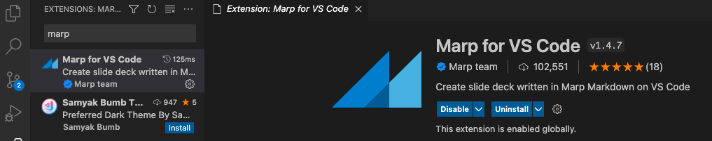
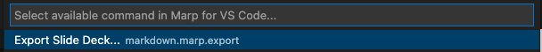
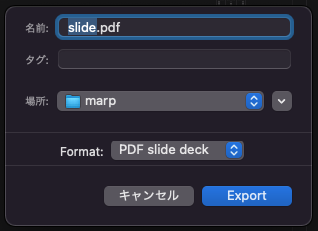
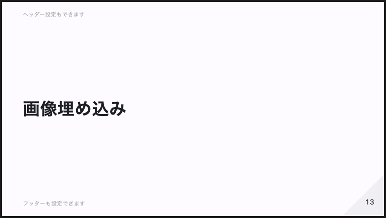

<style>
  section {
    text-align: left;
  }
</style>

# Marp でスライド作成

2022/02/20 Isoe Hiroyuki

# もくじ

- Marp とは
- Marp fo VS Code 導入
- Merp の設定
- 基本的な記法

# Marp とは

Marp(Markdown Presentation Ecosystem) は
MarkDown からスライドを生成してくれる仕組み
VSCode の拡張機能が提供されているので
VSCode だけでスライド作成できる

公式ページ：https://marp.app/

# 「Marp fo VS Code」導入

VSCode の Extensions タブで「marp」と検索
「Marp fo VS Code」をインストールする


# Merp の設定

スライド用の MarkDown ファイル`slide.md`を作成し
ファイルの先頭に Marp の設定を記述する

```front-matter
---
# Marpを有効にする
marp: true
# スライドのテーマ指定
theme: uncover
header: ヘッダー設定もできます
footer: フッターも設定できます
# ページ番号
paginate: true
---
```

# PDF 出力

Marp アイコンをクリック



# 基本的な記法と表示

## 文字装飾

文字装飾なし
`**太字**`：**太字**
`*斜体*`：_斜体_
`***太字+斜体***`：**_太字+斜体_**

---

## 順序なし箇条書き

```markdown
- 順序なし
  - 順序なし
    - 順序なし
- 順序なし
```

- 順序なし
  - 順序なし
    - 順序なし
- 順序なし

---

### 順序あり箇条書き

```markdown
1. 順序あり
   1. 順序あり
      1. 順序あり
2. 順序あり
```

1. 順序あり
   1. 順序あり
      1. 順序あり
2. 順序あり

---

### 引用

```markdown
> 引用は以下の表示になります
>
> 複数行はこうなります
>
> > 二重引用もあります
```

> 引用は以下の表示になります
>
> 複数行はこうなります
>
> > 二重引用もあります

---

### インラインコード

```markdown
次のコマンドを実行する`ruby --versions`
```

次のコマンドを実行する`ruby --versions`

---

### コードブロック

````markdown
```ruby
def hello_world
  p 'Hello World'
end
```
````

```ruby
def hello_world
  p 'Hello World'
end
```

---

### リンク

```markdown
[とらのあなラボ](https://yumenosora.co.jp/tora-lab)
```

[とらのあなラボ](https://yumenosora.co.jp/tora-lab)

---

### 画像埋め込み

```markdown

```


---

### テーブル

```markdown
| 左寄せ | 中央寄せ | 右寄せ |
| :----- | :------: | -----: |
| 左     |    中    |     右 |
| 寄     |    央    |     寄 |
| せ     |    寄    |     せ |
|        |    せ    |        |
```

| 左寄せ | 中央寄せ | 右寄せ |
| :----- | :------: | -----: |
| 左     |    中    |     右 |
| 寄     |    央    |     寄 |
| せ     |    寄    |     せ |
|        |    せ    |        |

# カスタム

[組み込みテーマの CSS](https://github.com/marp-team/marp-core/tree/26f2402d443d26af387adb0ee86cafa1149beb34/themes)

CSS を作成することでカスタムテーマを作成することもできます
が、Web には挫折談が結構あるのである程度覚悟が必要
